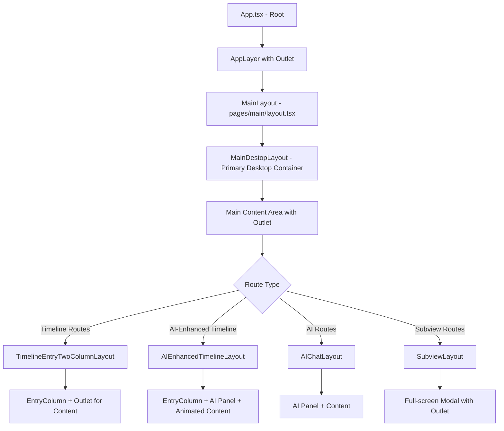

# FreeFolo App Layout Architecture Analysis

## Overview

The FreeFolo desktop application uses a nested layout system built on React Router v7 with the `Outlet` component pattern. This architecture provides a flexible, hierarchical structure for timeline, subview, and content layouts.

## Layout Hierarchy & Route Flow

The application's layout system follows a hierarchical structure where each level handles specific responsibilities:



## Core Layout Components

### 1. App Component (`App.tsx`)

**Location**: `src/App.tsx`  
**Purpose**: Root application wrapper  
**Outlet Usage**: `<Outlet />` renders the main layout tree

```typescript
// App.tsx structure
<RootProviders>
  <Titlebar /> // Electron only
  <AppLayer>
    <Outlet /> // Renders main layout based on routes
  </AppLayer>
</RootProviders>
```

### 2. MainDestopLayout (`MainDestopLayout.tsx`)

**Location**: `src/modules/app-layout/MainDestopLayout.tsx`  
**Purpose**: Primary desktop application layout  
**Key Features**:

- Subscription sidebar (left)
- Main content area (right)
- Authentication modals
- Global error boundaries
- App-wide panels (search, commands)

```typescript
// MainDestopLayout structure
<RootContainer>
  <EntriesProvider>
    <SubscriptionColumnContainer /> // Left sidebar
    <main>
      <AppErrorBoundary>
        <Outlet /> // Renders timeline/AI/subview layouts
      </AppErrorBoundary>
    </main>
  </EntriesProvider>
  <GlobalPanels />
</RootContainer>
```

### 3. TimelineEntryTwoColumnLayout (`TimelineColumnLayout.tsx`)

**Location**: `src/modules/app-layout/timeline-column/TimelineColumnLayout.tsx`  
**Purpose**: Two-column resizable layout for feed content  
**Key Features**:

- Resizable entry column (left)
- Content display area (right)
- Wide mode support
- Persistent column width settings

```typescript
// TimelineEntryTwoColumnLayout structure
<div className="flex min-w-0 grow">
  <div style={{width: position}}>
    <EntryColumn /> // Left: Entry list
  </div>
  <PanelSplitter /> // Resizable divider
  <Outlet /> // Right: Entry content
</div>
```

### 4. SubviewLayout (`SubviewLayout.tsx`)

**Location**: `src/modules/app-layout/subview/SubviewLayout.tsx`  
**Purpose**: Full-screen modal layout for discovery and utility pages  
**Key Features**:

- Glass morphism header with back navigation
- Scroll-based title animation
- Progress indicator FAB
- Smooth scroll behavior

```typescript
// SubviewLayout structure
<Focusable>
  <div className="relative flex size-full">
    <FloatingHeader /> // Glass header with back button
    <ScrollArea>
      <Outlet /> // Full-screen content (Discover, Power, etc.)
    </ScrollArea>
    <ProgressFAB /> // Scroll progress indicator
  </div>
</Focusable>
```

### 5. AIEnhancedTimelineLayout (`AIEnhancedTimelineLayout.tsx`)

**Location**: `src/modules/app-layout/ai-enhanced-timeline/AIEnhancedTimelineLayout.tsx`  
**Purpose**: Advanced timeline layout with integrated AI chat functionality  
**Key Features**:

- Entry list with animated content overlay
- Integrated AI chat panel (Fixed/Floating modes)
- Dynamic subscription column toggling
- Smooth entry transition animations
- Resizable AI panel with persistent settings

```typescript
// AIEnhancedTimelineLayout structure
<div className="relative flex min-w-0 grow">
  <div className="h-full flex-1">
    <EntryColumn /> // Entry list - always visible
    <AnimatedOverlays>
      <AIEntryHeader /> // Animated header overlay
      <EntryContent />  // Animated content overlay
    </AnimatedOverlays>
  </div>
  <AIChatPanel />   // Optional resizable AI panel
  <SubscriptionToggler /> // Dynamic subscription control
</div>
```

### 6. AIChatLayout (`AIChatLayout.tsx`)

**Location**: `src/modules/app-layout/ai/AIChatLayout.tsx`  
**Purpose**: Dynamic AI chat interface layout  
**Key Features**:

- Switchable panel styles (Fixed/Floating)
- User preference-based rendering
- Extensible panel system

## Route-to-Layout Mapping

The routing system connects URLs to specific layouts through the generated routes configuration:

### Route Structure Analysis

```typescript
// From generated-routes.ts
export const routes: RouteObject[] = [
  {
    path: "", // Root path
    lazy: () => import("./pages/(main)/layout"), // MainLayout wrapper
    children: [
      {
        path: "",
        Component: MainIndex, // Default timeline view
      },
      {
        path: "timeline/:timelineId/:feedId",
        lazy: () => import("./pages/(main)/(layer)/timeline/[timelineId]/[feedId]/layout"),
        // ^ This loads AIEnhancedTimelineLayout (with AI feature) or TimelineEntryTwoColumnLayout (fallback)
        children: [
          {
            path: ":entryId",
            lazy: () =>
              import("./pages/(main)/(layer)/timeline/[timelineId]/[feedId]/[entryId]/index"),
            // ^ Entry content rendered in AIEnhancedTimelineLayout's animated overlay or TimelineEntryTwoColumnLayout's Outlet
          },
        ],
      },
      {
        path: "",
        lazy: () => import("./pages/(main)/(layer)/(subview)/layout"),
        // ^ This loads SubviewLayout
        children: [
          {
            path: "discover",
            lazy: () => import("./pages/(main)/(layer)/(subview)/discover/index"),
            // ^ Discover page rendered in SubviewLayout's Outlet
          },
        ],
      },
      {
        path: "ai",
        lazy: () => import("./pages/(main)/(layer)/(ai)/ai/index"),
        // ^ AI page rendered in MainDestopLayout's Outlet
      },
    ],
  },
]
```

## Layout Flow Examples

### Example 1: Timeline Entry View

**URL**: `/timeline/1/feed-123/entry-456`

```
App (Outlet)
  → MainLayout (responsive wrapper)
    → MainDestopLayout (desktop container)
      → AIEnhancedTimelineLayout (AI-enhanced timeline)
        → EntryColumn (base) + EntryContent (animated overlay) + AIPanel (optional)
```

### Example 2: Discover Page

**URL**: `/discover`

```
App (Outlet)
  → MainLayout (responsive wrapper)
    → MainDestopLayout (desktop container)
      → SubviewLayout (full-screen modal)
        → DiscoverPage (via Outlet)
```

### Example 3: AI Chat

**URL**: `/ai`

```
App (Outlet)
  → MainLayout (responsive wrapper)
    → MainDestopLayout (desktop container)
      → AIChatLayout (dynamic panel)
```

## Key Architectural Patterns

### 1. Nested Outlets

Each layout level uses `<Outlet />` to render child routes, creating a flexible composition system:

```typescript
// Parent Layout
function ParentLayout() {
  return (
    <div className="layout-container">
      <Navigation />
      <main>
        <Outlet /> // Child layouts/pages render here
      </main>
    </div>
  )
}
```

### 2. Conditional Layout Rendering

Layouts adapt based on route parameters and user preferences:

```typescript
// TimelineEntryTwoColumnLayout
const inWideMode = views.find(v => v.view === view)?.wideMode || false
return (
  <div className="flex">
    <EntryColumn />
    {!inWideMode && <PanelSplitter />}
    <Outlet />
  </div>
)
```

### 3. Context-Aware Layouts

Layouts provide context to their children:

```typescript
// MainDestopLayout
<EntriesProvider>
  <SubscriptionColumnContainer />
  <main>
    <AppErrorBoundary>
      <Outlet /> // Child components can access EntriesContext
    </AppErrorBoundary>
  </main>
</EntriesProvider>
```

## Layout State Management

### Global Layout State

- **Feed Column Width**: `useUISettingKey("feedColWidth")`
- **Entry Column Width**: `useUISettingKey("entryColWidth")`
- **AI Panel Style**: `useAIChatPanelStyle()`

### Layout-Specific State

- **Scroll Position**: Managed in SubviewLayout
- **Resizer Position**: Managed in TimelineEntryTwoColumnLayout
- **Authentication State**: Managed in MainDestopLayout

## Responsive Behavior

### Desktop Layout (`MainDestopLayout`)

- Fixed sidebar with subscription list
- Resizable content areas
- Multi-column layouts with splitters

### Mobile Layout (via `withResponsiveComponent`)

```typescript
export const Component = withResponsiveComponent(
  () => Promise.resolve({ default: MainDestopLayout }),
  async () => {
    const { default: MobileLayout } = await import("~/modules/mobile")
    return { default: MobileLayout }
  },
)
```

## Error Boundaries & Fallbacks

### Layout-Level Error Handling

```typescript
// MainDestopLayout
const errorTypes = [
  ErrorComponentType.Page,
  ErrorComponentType.FeedFoundCanBeFollow,
  ErrorComponentType.FeedNotFound,
] as ErrorComponentType[]

<AppErrorBoundary errorType={errorTypes}>
  <Outlet />
</AppErrorBoundary>
```

## Performance Considerations

### Lazy Loading

All major layouts use React Router's lazy loading:

```typescript
const lazy16 = () => import("./pages/(main)/layout")
```

### Memoization

Critical layout dimensions are memoized:

```typescript
const entryColWidth = useMemo(() => getUISettings().entryColWidth, [])
```

### Event Handling Optimization

Scroll and resize handlers use passive listeners and debouncing:

```typescript
$scroll.addEventListener("scroll", handler, { passive: true })
```

## Development Guidelines

### Adding New Layouts

1. Create layout component in `src/modules/app-layout/`
2. Add JSDoc documentation with structure diagrams
3. Export from appropriate page component in `src/pages/`
4. Test with nested routes to ensure Outlet rendering works correctly

### Layout Component Structure

````typescript
/**
 * LayoutName Component
 *
 * Brief description of layout purpose and features.
 *
 * Layout Structure:
 * ```
 * LayoutName
 * ├── Header/Navigation
 * ├── Content Area
 * │   └── Outlet (renders child routes)
 * └── Footer/Controls
 * ```
 *
 * @component
 * @example
 * // Usage context and route examples
 */
export function LayoutName() {
  return (
    <div className="layout-container">
      <Navigation />
      <main>
        <Outlet />
      </main>
    </div>
  )
}
````

### Best Practices

1. **Always use Outlet**: Enable nested routing capabilities
2. **Document Layout Structure**: Include ASCII diagrams in JSDoc
3. **Handle Error States**: Wrap Outlets in appropriate error boundaries
4. **Optimize for Performance**: Use lazy loading and memoization
5. **Test Responsive Behavior**: Ensure layouts adapt to different screen sizes
6. **Maintain Context**: Provide necessary context to child components

## Conclusion

The Follow app's layout architecture demonstrates sophisticated use of React Router v7's nested routing capabilities. The hierarchical Outlet system creates a flexible, maintainable structure that supports multiple application modes while maintaining clean separation of concerns. Each layout level handles specific responsibilities, from global app state (MainDestopLayout) to specialized interfaces (TimelineEntryTwoColumnLayout, SubviewLayout), creating a scalable foundation for the application's diverse content types and user interfaces.
